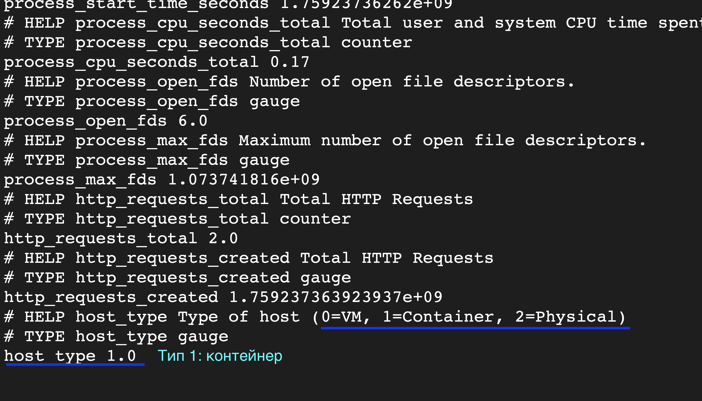
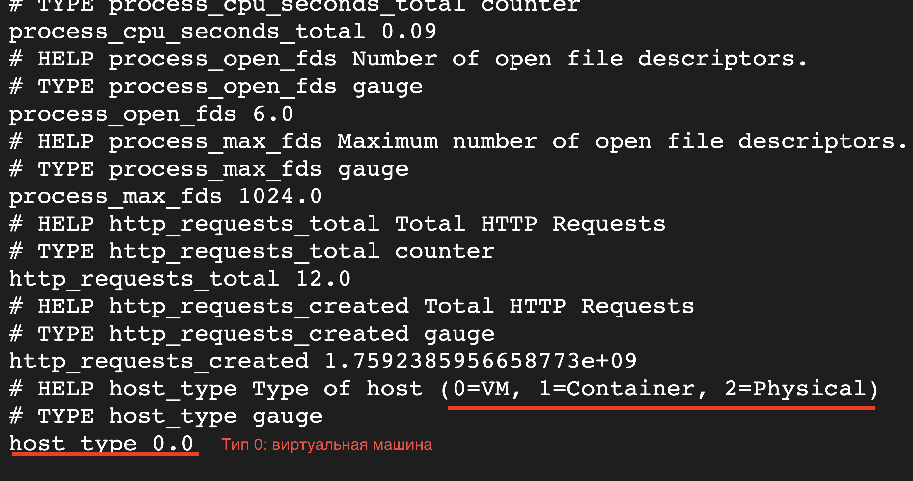

Тестовое задание Kaspersky

Проект автоматизирует развертывание микросервиса с Prometheus метриками на Yandex Cloud с использованием Terraform и Ansible.
Все бонусные задания выполнены

Предварительные требования

Yandex Cloud аккаунт
Terraform >= 1.0
Ansible >= 2.9

# Клонируйте репозиторий
git clone https://github.com/veritateal-pixel/test-kaspersky

# Запустите развертывание в режиме контейнера (Docker)

###########################
sudo sh deploy.sh container
###########################

# Запустите развертывание в режиме сервиса systemd

#########################
sudo sh deploy.sh virtual
#########################

🔧 Функциональность

Prometheus метрики на порту 8080
Определение типа хоста (VM/Container/Physical)
Автоматизированное развертывание инфраструктуры
Конфигурация через Ansible

📊 Метрики

http_requests_total - счетчик HTTP запросов
host_type - тип хоста:

0 = VM
1 = Container
2 = Physical
